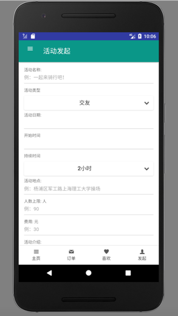
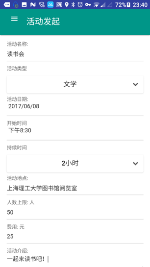
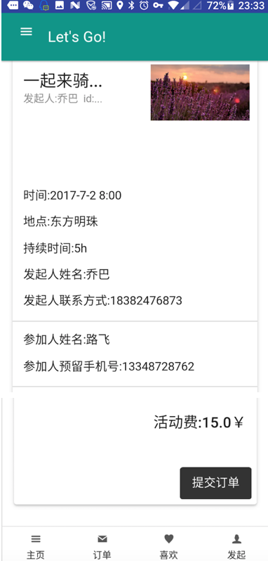
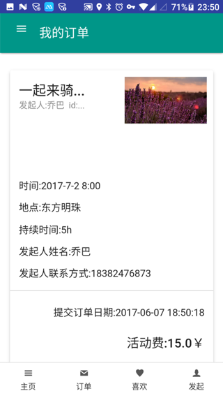

# Project2: "Let's Go"---Event Launching App

## Statement

I did this project when I was doing my bachelor in China. I used a template called  to design my web pages to make the website look nice and clear, making a few minor changes. I did the back-end(Java) and database design(SQL) myself.

This is hybrid app which means it can both run on the browser and your Android devices(did not implement for IOS, but ideally feasible). To be more specific, same operation should be doable on both platforms. Take 'uploading images' function as example, the code for web could simply be `<input type='file'/>`, but it won't work for Android Framework, so it is the tricky part, it needs to call the API of Android platform. But nowadays there are several powerful frameworks such as [Flutter](https://flutter.dev/) which could easily address such problems.

## Techniques I used

1. CSS/HTML/JS
2. JQuery
3. JQuery Mobile
4. SQL
5. Java
   - servlet
   - DAO
   - javabean
   - listener
   - filter
6. Android API

## Functions implemented

- Launch an event (as an organizer)

*Fill in the details of the event including name, event type, date, time, time of duration, location, price, etc.*

*The event has been successfully launched!*

---

- 'Like' the event

*Once you click on the loving-heart icon, the event will be added to your favourites.*

---

- View my favorites

*You can view the events that you were interested in and already pressed the 'like' button.* 

---

- Register for an event

*Register for the event you like.*

---

- View your orders

*You can always view your history orders.*

---

