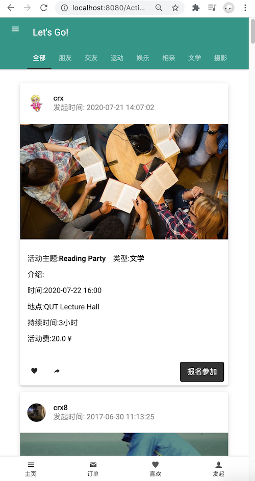
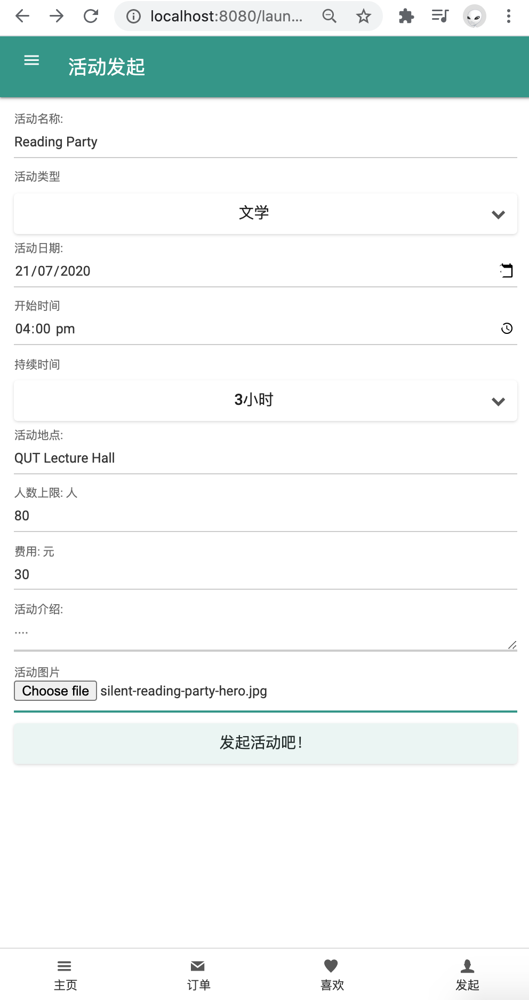
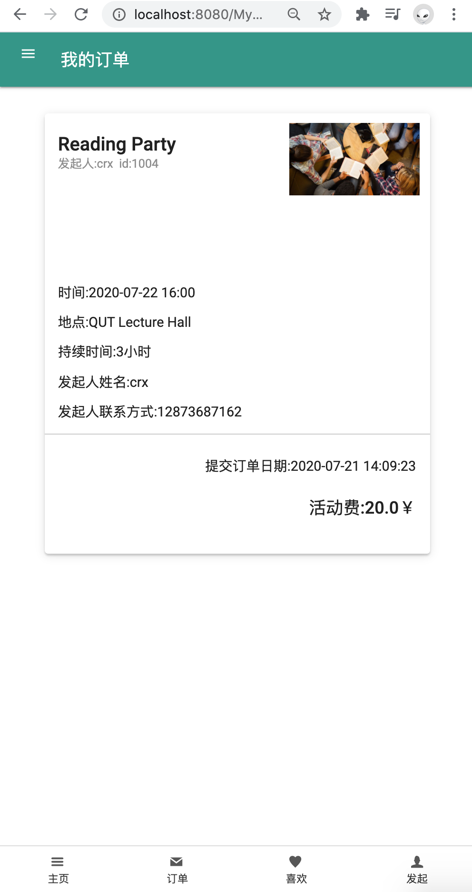

# "Let's Go" -- Event App

## Statement

This is hybrid app that can both run on the browser and your Android devices(did not implement for IOS, but ideally feasible). To be more specific, same operation should be doable on both platforms. Take 'uploading images' function as example, the code for web could simply be `<input type='file'/>`, but it won't work for Android Framework, so it is the tricky part, it needs to call the API of Android platform. But nowadays there are several powerful frameworks such as [Flutter](https://flutter.dev/) or [React Native](https://reactnative.dev/) which could easily address such problems.

## Tech Stack

1. CSS/HTML/JS
2. JQuery
3. JQuery Mobile
4. SQL
5. Java
   - servlet
   - DAO
   - javabean
6. Android API

------

## **Target Users:**

1. **Event Organizers**

2. **Event Participants**

## **Functionalites:**

#### **Events Exploring:**

------

#### Event Launching

------

#### Event Order

------

#### Event Favorites

